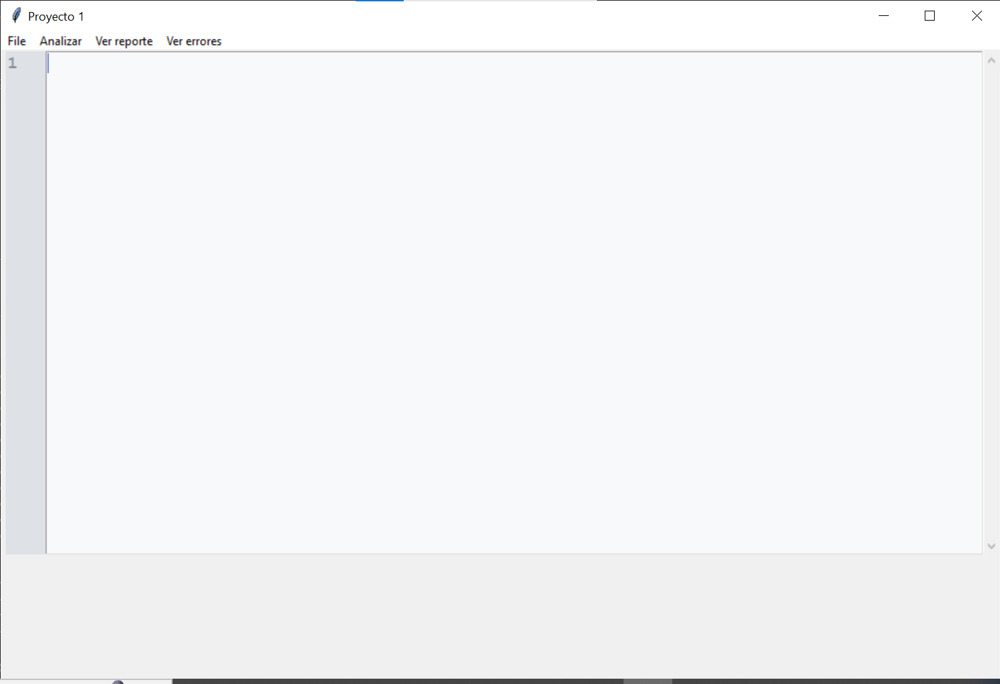

# LFP_S2_2023_Practica_201712620
# Práctica 1 - Lenguajes Formales y de Programación  

### Universidad de San Carlos de Guatemala
### Facultad de Ingeniería
### Escuela de Ciencias y Sistemas
### Lenguajes Formales y de Programación

> Nombre
> - Luis Andres Calvo Arreaga         201712620
# Manual Tecnico

La siguiente aplicacion fue creada en lenguaje Python haciendo uso de la librería de Tkinter y el Paradigma POO.
Esta se divide en varios segmentos, y comenzaremos visualizando el Analizador Lexico ya que es la parte mas importante.
<strong>la clase Analizar contiene lo siguiente:</strong>

<strong>Importaciones y definición de Token:</strong> Aquí importas algunas bibliotecas necesarias y defines un namedtuple llamado Token para representar tokens con un valor, línea y columna.

<strong>Inicialización de variables globales:</strong> Estableces algunas variables globales como line, col, y tokens para rastrear la posición actual en el análisis léxico y almacenar los tokens encontrados.

<strong>Diccionario de configuración:</strong> Creas un diccionario llamado configuracion para almacenar información relacionada con la configuración.

<strong>Función tokenize_string:</strong> Esta función toma una cadena de entrada y un índice como entrada y tokeniza una cadena entre comillas dobles (un string) dentro de la entrada. Devuelve el token y la posición actual en la cadena.

<strong>Función tokenize_number:</strong> Esta función toma una cadena de entrada y un índice como entrada y tokeniza un número (ya sea entero o decimal) dentro de la entrada. Devuelve el token y la posición actual en la cadena.

<strong>Función tokenize_input:</strong> Esta función toma una cadena de entrada completa y la divide en tokens. Itera a través de la entrada, maneja espacios en blanco, cadenas, números y otros caracteres especiales.

<strong>Función get_instruccion:</strong> Esta función se utiliza para analizar los tokens generados y construir instrucciones. Las instrucciones están relacionadas con operaciones aritméticas y trigonométricas, así como configuraciones relacionadas con texto, fondo, fuente y forma. Devuelve un objeto que representa una instrucción.

<strong>Función create_instructions:</strong> Utiliza get_instruccion para crear una lista de instrucciones a partir de los tokens generados. También agrega información de configuración al árbol. Devuelve una lista de instrucciones.

<strong>Función analizar:</strong> Toma una cadena de entrada, tokeniza y analiza las instrucciones, y luego interpreta y muestra los resultados en la consola.

<strong>Función Analizar_op:</strong> Similar a analizar, pero muestra los resultados de las operaciones en una ventana emergente utilizando la biblioteca messagebox.

<strong>Función tokenize_input_reporte:</strong> Esta función es similar a tokenize_input, pero se utiliza para generar un informe de errores. A diferencia de tokenize_input, no agrega tokens a la lista tokens, sino que registra errores en un formato específico.

### luego pasamos a la carpeta de expresiones
En esta encontraremos la clase abstracta <strong>expresion</strong>.
y sus 2 clases hijas que heredan de la ella misma.<strong>(aritmeticas, trigonometricas)</strong>

En la clase <strong>expresion</strong> defines la clase abstracta Expresion y la haces heredar de la clase ABC. Esto indica que Expresion es una clase abstracta y que se utilizará como base para definir otras clases que implementarán métodos específicos.

@abstractmethod: Este es un decorador que se utiliza justo antes de la definición de un método. Indica que el método decorado es abstracto y debe ser implementado por cualquier subclase de la clase Expresion. En este caso, el método abstracto se llama interpretar.

<strong>def interpretar(self, contexto):</strong> Este es el método abstracto que todas las subclases de Expresion deben implementar. Toma dos parámetros: self, que es una referencia al objeto en sí, y contexto, que es un objeto que generalmente se utiliza para almacenar información o estado necesario para la interpretación de la expresión. Sin embargo, la implementación concreta de este método dependerá de las subclases concretas que hereden de Expresion.

En la clase <strong>aritmeticas</strong>

La clase tiene un constructor __init__ que inicializa varios atributos, incluyendo el tipo de operación aritmética, los dos valores involucrados en la expresión, y la ubicación de la expresión en un código fuente.
Implementa un método interpretar que evalúa la expresión aritmética y devuelve su resultado.
Implementa un método __str__ que proporciona una representación en forma de cadena de la instancia de la clase.

<strong>Funcionalidad:</strong>

El método <strong>interpretar</strong> realiza los siguientes pasos:
Evalúa los valores de la expresión (valor1 y valor2), que pueden ser números o expresiones más complejas.
Realiza una operación aritmética específica (como suma, resta, multiplicación, etc.) según el tipo de operación especificado.
Grafica la expresión en un árbol junto con los nodos que representan los valores y la operación realizada.
Devuelve el resultado de la operación, redondeado a dos decimales, así como los valores originales de valor1 y valor2 y el tipo de operación realizada.

En la clase <strong>trigonometricas</strong> tiene un constructor __init__ que inicializa varios atributos, incluyendo el tipo de operación trigonométrica, el valor sobre el cual se aplicará la operación, y la ubicación de la expresión en un código fuente.
Implementa un método interpretar que evalúa la expresión trigonométrica y devuelve su resultado.

<strong>Funcionalidad:</strong>
El método interpretar realiza los siguientes pasos:
Evalúa el valor sobre el cual se aplicará la operación (valor), que puede ser un número o una expresión más compleja.
Realiza una operación trigonométrica específica (como seno, coseno, tangente, inverso) según el tipo de operación especificado (self.tipo).
Grafica la expresión en un árbol junto con el nodo que representa el valor y la operación realizada.
Devuelve el resultado de la operación trigonométrica, redondeado a dos decimales.
Operaciones Trigonométricas:

La clase admite las siguientes operaciones trigonométricas: seno, coseno, tangente e inverso.
Dependiendo del tipo de operación, se utiliza la biblioteca math de Python para calcular el resultado correspondiente.

### clase Arbol
<strong>Constructor (__init__):</strong>En el constructor, se inicializa la clase Arbol. Se crea un objeto graphviz.Digraph que se utilizará para representar y visualizar el árbol. El comentario del árbol incluye una marca de tiempo para identificarlo de manera única. Además, se inicializa un contador (self.counter) que se utiliza para generar nombres únicos de nodos.

<strong>Método agregarConfiguracion:</strong> Este método se utiliza para configurar la apariencia de los nodos en el gráfico del árbol. Toma un diccionario llamado confg como entrada, que contiene información sobre el fondo, fuente y forma de los nodos. Luego, aplica estas configuraciones al objeto dot de graphviz para los nodos del árbol.

<strong>Método agregarNodo:</strong> Este método agrega un nodo al gráfico del árbol. Toma un valor como entrada y genera un nombre único para el nodo (usando el contador) antes de agregarlo al gráfico. El valor se muestra en el nodo.

<strong>Método agregarArista:</strong> Este método agrega una arista entre dos nodos del árbol. Toma los nombres de los dos nodos como entrada y crea una conexión entre ellos en el gráfico del árbol.

<strong>Método generarGrafica:</strong> Este método genera y guarda la representación gráfica del árbol en un archivo. Utiliza el método render de graphviz para crear el gráfico en un archivo y luego lo muestra en la vista predeterminada del sistema. También guarda el archivo en formato .dot para su posterior referencia.

<strong>Método obtenerUltimoNodo:</strong> Este método devuelve el nombre del último nodo creado en el árbol. Esto se logra utilizando el contador para generar el nombre del nodo.

<strong>Instancia de la clase Arbol:</strong> Al final del código, se crea una instancia de la clase Arbol llamada arbol. Esto se hace para que puedas utilizar esta instancia para crear y gestionar gráficos de árbol a lo largo de tu programa.

### Por ultimo pasamos a la intefaz grafica
### Clase Gui
<strong>ScrollText:</strong> Esta es una clase que hereda de tk.Frame y se utiliza para crear un área de texto con desplazamiento en la interfaz gráfica. Permite al usuario escribir y editar texto en un área que incluye números de línea en el lado izquierdo.

<strong>TextLineNumbers:</strong> Esta es otra clase que hereda de tk.Canvas y se utiliza para mostrar los números de línea en el área de texto. Está vinculada al widget de texto y se encarga de dibujar los números de línea.

<strong>Ventana:</strong> Esta es la clase principal de la aplicación que hereda de tk.Tk. Define la ventana principal de la aplicación con un menú. Aquí están las características clave:

La ventana principal se configura con un título y una geometría inicial.
Incluye un área de ScrollText que permite al usuario escribir y editar texto con desplazamiento y números de línea.
Hay un menú que permite al usuario abrir, guardar y realizar acciones específicas, como "Analizar" y "Ver reporte".
La función open_file permite al usuario abrir un archivo y cargar su contenido en el área de texto.
La función save_file permite al usuario guardar el contenido actual del área de texto en un archivo.

<strong>La función analizar_texto</strong> analiza el contenido del área de texto utilizando una función llamada analizar y muestra el resultado en un visor de gráficos (usando arbol.dot.view()).

<strong>La función analisis_Operaciones</strong> realiza una operación específica (no proporcionada en el código) en el contenido del área de texto.
Inicialización de la Aplicación: Al final del código, se crea una instancia de la clase Ventana llamada app y se inicia el bucle principal de la aplicación (app.mainloop()).

# Manual De Usuario
El siguiente programa es un Interfaz grafica emulando un editor de texto tal como se muetra en la siguiente imagen.

Este cuenta con las siguientes opciones de menu en la esquina superior izquierda.

<strong>File:</strong> Esta opcion desplega un menu mostrado a continuacion:

En este encontraremos multiples opciones...

<strong>New:</strong> Deja el editor de texto vacio para que uno pueda crear un nuevo archivo.

<strong>Open:</strong> Este desplegara una ventana de buscador de archivos para poder abrir un archivo de texto en la intefaz grafica.

<strong>Save file:</strong> con esta opcion podremos guardar, desde un buscador de archivos, el texto escrito en la interfaz grafica y asignarle un nombre para almacenarlo en algun lugar del computador.

<strong>Exit:</strong> Esta opcion cierra por completo la aplicacion creada.

### Funcionalidad sobre el analizador Lexico de un archivo Json con operaciones aritmeticas y trigonometricas

<strong>Esta seccion es bastante interesante, ya que para ver el funcionamiento de el mismo tenemos que tener claro ciertas cosas:</strong>
<strong>1.</strong> Solo permite las operaciones mostradas a continuacion y con la siguiente sintaxis:

<strong>2.</strong> Solo permite Archivos de tipo .Json para realizar el analisis y las operaciones.

<strong>3.</strong> Tienen que tener la siguiente estructura.

### Siguientes funciones de la barra de la esquina superior izquierda

<strong>Analizar:</strong> muestra los resultados de todas las operaciones contenidas en el archivo .Json Analizado

<strong>Ver Reporte:</strong> Despliega un PDF en el visor predeterminado de imagenes del equipo utilizado, que contiene un grafo de los resultados y jerarquias de las operaciones analizadas del archivo .Json ingresado.

<strong>Ver Errores:</strong> muestra un archivo de salida .Json con los errores un dicha estructura y devueltos de la misma manera.

<<<<<<< HEAD
### Manual De Usuario
El siguiente programa es un Interfaz grafica emulando un editor de texto tal como se muetra en la siguiente imagen.

=======
>>>>>>> 1671f2dfd092a9438b19eb854466d38c5ba71add
